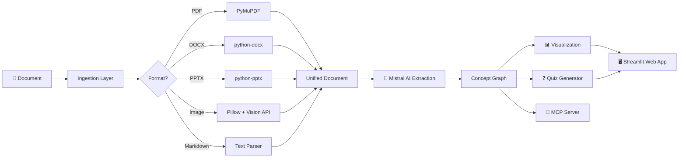

# 🧠 Concept Explorer

**AI-powered interactive learning tool that transforms complex documents into navigable, visual concept maps with simplified explanations at multiple complexity levels.**

---

> Upload any document → AI extracts key concepts → Explore an interactive knowledge graph → Test yourself with auto-generated quizzes

<!-- Screenshot placeholder: The UI shows a dark-themed Streamlit app with an interactive network graph of colorful nodes (concepts) connected by edges (relationships). A side panel displays the selected concept with tabbed explanations at Beginner/Intermediate/Expert levels, source excerpts, and clickable related concepts. -->


---

## 🤔 Why This Project?

**Complex documents are hard to learn from.** Technical papers, architecture documents, and educational materials often contain densely interconnected concepts that are difficult to navigate linearly. Readers struggle to:

- Identify the key concepts and how they relate to each other
- Understand material at their current knowledge level
- Test their comprehension as they learn

**Concept Explorer solves this** by using AI to automatically extract concepts, map their relationships, generate multi-level explanations, and create quizzes — all presented through an interactive visual interface.

---

## ✨ Features

| Feature | Description |
|---------|-------------|
| 📄 **Multi-Format Ingestion** | Upload PDF, DOCX, PPTX, images (PNG/JPG), or Markdown files |
| 🤖 **AI Concept Extraction** | Mistral AI identifies key concepts and their relationships |
| 🗺️ **Interactive Concept Map** | Explore a visual network graph with zoom, filter, and search |
| 📊 **Three Difficulty Levels** | 🟢 Beginner (ELI5) · 🟡 Intermediate · 🔴 Expert explanations |
| ❓ **Auto-Generated Quizzes** | Test your understanding with AI-created multiple-choice questions |
| 🎮 **Demo Mode** | Works without an API key using pre-computed concepts |
| 🔌 **MCP Server** | Integrate with Claude Desktop via Model Context Protocol |
| 🌙 **Dark Theme** | Professional, clean dark UI built with Streamlit |

---

## 🚀 Quick Start

### 1. Clone & Install

```bash
git clone https://github.com/your-username/concept-explorer.git
cd concept-explorer
pip install -r requirements.txt
```

### 2. Run in Demo Mode (no API key needed)

```bash
streamlit run app.py
```

Click **"🚀 Load Demo"** to explore a pre-built concept map about Zero Trust Architecture.

### 3. Run with Mistral AI

```bash
export MISTRAL_API_KEY=your_key_here
streamlit run app.py
```

Upload any supported document and the AI will extract concepts automatically.

---

## 🏗️ Architecture



**Data Flow:**
1. **Ingestion** — Format-specific parsers extract text, tables, and images into a unified `Document`
2. **AI Extraction** — Mistral AI identifies concepts, relationships, multi-level explanations, and quiz questions
3. **Concept Graph** — Structured as nodes (concepts) and edges (relationships) using dataclasses
4. **Visualization** — Interactive pyvis/vis.js network graph rendered in the browser
5. **Quiz** — Auto-generated multiple-choice questions with scoring

---

## 📁 Supported Formats

| Format | Library | What's Extracted |
|--------|---------|-----------------|
| PDF | PyMuPDF (fitz) | Text per page + embedded images |
| DOCX | python-docx | Paragraphs + tables + images |
| PPTX | python-pptx | Slide text + speaker notes + images |
| PNG/JPG | Pillow | Base64-encoded for Mistral Vision API |
| Markdown | Built-in parser | Text split by headings |

---

## 🔌 MCP Integration

Use Concept Explorer as an MCP server with Claude Desktop or any MCP-compatible client.

### Setup

```bash
pip install -r requirements-mcp.txt
```

### Claude Desktop Configuration

Add to your Claude Desktop MCP config (`~/Library/Application Support/Claude/claude_desktop_config.json`):

```json
{
  "mcpServers": {
    "concept-explorer": {
      "command": "python",
      "args": ["-m", "mcp_server.server"],
      "cwd": "/path/to/concept-explorer",
      "env": {
        "MISTRAL_API_KEY": "your_key_here"
      }
    }
  }
}
```

### Available Tools

| Tool | Description |
|------|-------------|
| `ingest_document` | Ingest a file and extract concepts → returns document ID |
| `get_concepts` | Get all concepts and relationships for a document |
| `explain_concept` | Get explanation at a given difficulty level |
| `quiz` | Get quiz questions for a concept |
| `search_concepts` | Semantic search across all loaded concepts |

---

## 🛠️ Tech Stack

| Technology | Version | Purpose |
|-----------|---------|---------|
| Python | 3.10+ | Runtime |
| Streamlit | ≥ 1.30 | Web application framework |
| pyvis | ≥ 0.3.2 | Interactive network graph visualization |
| PyMuPDF | ≥ 1.23 | PDF text & image extraction |
| python-docx | ≥ 1.1 | DOCX parsing |
| python-pptx | ≥ 0.6.23 | PPTX parsing |
| Pillow | ≥ 10.0 | Image handling |
| mistralai | ≥ 1.0 | AI concept extraction |
| NetworkX | ≥ 3.2 | Graph data structures |
| MCP SDK | ≥ 1.0 | Model Context Protocol server |

---

## 🎮 Demo Mode

Concept Explorer includes a complete demo that works **without any API key**:

- **Document**: A ~500-word explanation of Zero Trust Architecture
- **Pre-computed concepts**: 8 interconnected concepts (Zero Trust, Microsegmentation, Least Privilege, MFA, Identity Verification, Network Perimeter, Continuous Monitoring, Encryption)
- **Full content**: Each concept includes all 3 difficulty levels of explanation + 2 quiz questions

The app automatically detects when no `MISTRAL_API_KEY` is set and offers demo mode.

---

## 📂 Project Structure

```
concept-explorer/
├── app.py                     # Streamlit entry point
├── requirements.txt           # Core dependencies
├── requirements-mcp.txt       # MCP server dependencies
├── .env.example               # Environment variable template
├── ingestion/
│   ├── base.py               # Ingestor base class + Document dataclass
│   ├── pdf_ingestor.py       # PDF extraction (PyMuPDF)
│   ├── docx_ingestor.py      # DOCX extraction (python-docx)
│   ├── pptx_ingestor.py      # PPTX extraction (python-pptx)
│   ├── image_ingestor.py     # Image handling (Pillow)
│   └── markdown_ingestor.py  # Markdown text parsing
├── ai/
│   ├── extractor.py          # ConceptExtractor (Mistral API)
│   ├── models.py             # Concept, Relationship, ConceptGraph dataclasses
│   └── prompts.py            # AI prompt templates
├── visualization/
│   └── graph.py              # pyvis network graph builder
├── mcp_server/
│   ├── server.py             # MCP server implementation
│   └── mcp_config.json       # Claude Desktop config example
├── demo/
│   ├── sample_zero_trust.md  # Demo document
│   ├── sample_concepts.json  # Pre-computed concept graph
│   └── loader.py             # Demo data loader
└── tests/
    └── test_ingestion.py     # Unit tests
```

---

## 🧪 Running Tests

```bash
python -m pytest tests/ -v
```

Or with unittest:

```bash
python -m unittest discover tests/ -v
```

---

## 🤝 Contributing

Contributions are welcome! Here's how:

1. **Fork** the repository
2. **Create** a feature branch (`git checkout -b feature/amazing-feature`)
3. **Commit** your changes (`git commit -m 'Add amazing feature'`)
4. **Push** to the branch (`git push origin feature/amazing-feature`)
5. **Open** a Pull Request

### Ideas for Contributions

- Add more file format support (LaTeX, HTML, EPUB)
- Implement concept graph export (JSON, GraphML)
- Add spaced-repetition for quiz questions
- Support multiple AI providers (OpenAI, Anthropic)
- Add collaborative annotation features

---

## 📄 License

This project is licensed under the MIT License — see the [LICENSE](LICENSE) file for details.

---

<div align="center">

**Built with ❤️ using [Streamlit](https://streamlit.io) and [Mistral AI](https://mistral.ai)**

</div>
